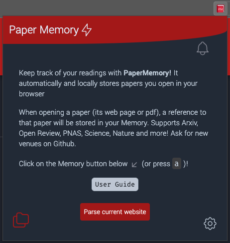
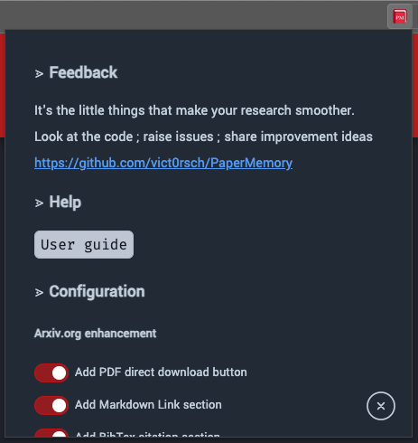
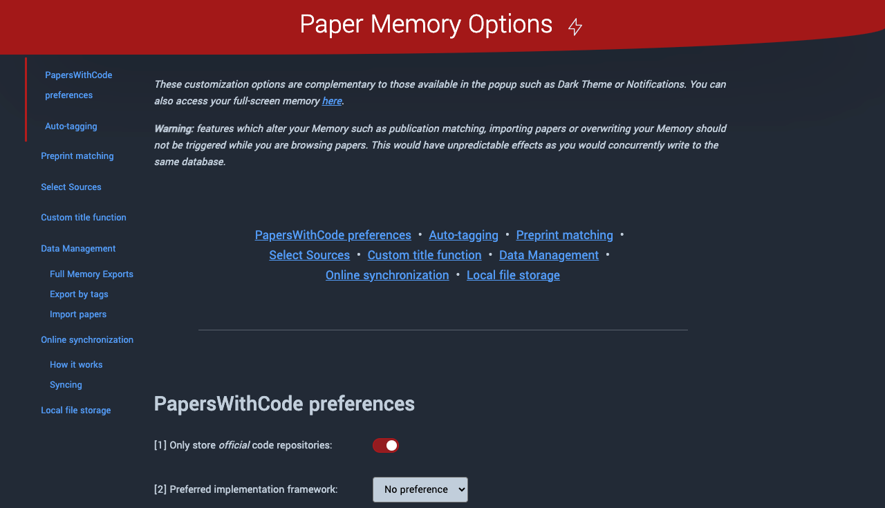

# Configuring PaperMemory

## Keyboard Shortcuts

By default, and _if_ they are not already attributed, the following keyboard shortcuts are available:

* ++cmd+shift+"E"++ will open PaperMemory's popup on a **Mac**, ++ctrl+shift+"M"++ on **Linux & Windows**.
* ++cmd++ / ++ctrl++ + ++shift+"S"++ will try to download the pdf of the current paper. If you have enabled this feature in the menu, the paper will be downloaded in your PaperMemoryStore (see thee advanced options page for more info)
* ++cmd++ / ++ctrl++ + ++shift+"L"++ will trigger the manual parsing of a paper if you have disabled automatic paper detection in the menu

All those shortcuts can be changed/set from `chrome://extensions/shortcuts` (:fontawesome-brands-chrome: Chrome / :simple-brave: Brave / :fontawesome-brands-edge: Edge) or `about:addons` (:fontawesome-brands-firefox-browser: Firefox).

### Keyboard Navigation

Navigate the Popup with your keyboard:

  * Open the Memory
    * ++"A"++ from the popup's home will open it
    * navigate to the bottom left button with ++tab++ and hit ++enter++
  * Search
    * Search field is automatically focused on memory open
    * Navigate to the top input with ++tab++ or ++shift+tab++
  * Navigate papers
    * ++tab++ will iterate through papers down the list
    * ++shift+tab++ will go back up the list
  * Edit a paper
    * Press ++e++ to _edit_ the paper's metadata: tags, code and note when the paper is *focused* (from click or keyboard ++tab++ navigation)
      * Navigate through fields with (++shift++ +) ++tab++: tags and note if you're on a paper's page.
    * Press ++enter++ to _open_ a focused paper (*focus* an existing tab with the paper or *create a new tab* to the paper's pdf if it's not open already)
    * ++backspace++ to _delete_ a focused paper (a confirmation will be prompted first don't worry 👮‍♀️)
  * Close Memory or Menu

## Popup Menu


<p align="center" markdown>
{ align=left .popup-display }
{ align=right .popup-display }
</p>

<p style="clear: both;"/>

The following :fontawesome-solid-toggle-on: items are displayed in PaperMemory's :octicons-gear-16: Popup Menu and can be changed anytime (close and re-open popup to see changes).

---

### Arxiv enhancements

`Add PDF direct download button`

:   Add the blue animated button to download the PDF to your Downloads without opening it.

`Add Markdown Link section`

:   In the right-most column on ArXiv.org, add the copy-able box with a :material-language-markdown-outline: Markdown-ready link `[$title]($url)`.

`Add BibTex citation section`

:   In the right-most column on ArXiv.org, add the copy-able box with a :tabler-math-function: BibTex citation.

---

### User interface

`Display notification when a paper is added`

:   Enable/Disable the red sliding notification displayed by PaperMemory when a Paper is parsed or a new code repository is found.

`Use Dark Mode`

:   Choose between light and dark mode for the Popup, Advanced Options and BibMatcher.

`Directly open the Memory when not on a Paper's page`

:   This feature assumes that your primary reason to open PaperMemory -- when you're not on a paper's page -- is to look for a paper in your Memory and therefore directly opens it without you cliking on the :material-folder-multiple-outline: button or pressing ++a++.

`Change paper tab titles`

:   By default, PaperMemory will replace your browser's tab titles with the paper's title so they are more easily searched and bookmarked.

`Add a link to SciRate in the popup`

:   Add a :tabler-scirate: icon to your papers to open directly on [SciRate](https://scirate.com).

`Add a link to arXiv Vanity in the popup`

:   Add a :tabler-arxiv-vanity: icon to your papers to open directly on [ArXiv Vanity](https://www.arxiv-vanity.com/).

`Add a link to ar5iv in the popup`

:   Add a :tabler-ar5iv: icon to your papers to open directly on [ar5iv](https://ar5iv.labs.arxiv.org/).

`Add a link to the HuggingFace paper page in the popup (Arxiv only)`

:   Add a :tabler-hf-logo-transparent-darktheme: icon to your papers to open directly on [HuggingFace Papers](https://huggingface.co/papers).


### Functionalities

`Include a paper's venue and year when available in the Markdown link`

:   Choose between `[$title]($url)` and `[$title -- $venue ($year)]($url)` when creating the :material-language-markdown-outline: Markdown links for a paper (only if a venue is known).

`Favor PDFs for paper links (otherwise, links will point to a paper's abstract page)`

:   Whenever a link is involved (:material-language-markdown-outline:, :tabler-external-link:, :octicons-link-24: etc.) prefer linking to the online PDF (if known) over the default HTML/Abstract page.

`Only record papers on their pdf pages, not from their abstracts`

:   Prevent PaperMemory from recording *all* papers, but only those of which you open the PDF.

`Disable automatic recording of papers. You will have to manually open the popup and click a button`

:   Prevent PaperMemory from recording *any* paper, you will have to trigger the parsing from the Popup or the [Keyboard Shortcut](./configuration.md#keyboard-shortcuts).

`When hitting Enter on a memory item, open a local PDF file when one is available instead of the the link to the paper.`

:   Choose to open the local PDF file you have in your `Downloads/` (if any) instead of opening the online version of the PDF, when pressing ++enter++ on a paper in your Memory.

`Download pdfs to PaperMemory's folder in your Downloads to be able to open them instead of re-downloading.`

:   Enable the `PaperMemoryStore/` folder in your `Downloads/` to enable PaperMemory to handle local files instead of re-downloading online PDFs every time.

`Enable parsing of arbitrary website by adding a button in the popup.`

:   Adds the `Parse Current Website` button when on an unknown web page (*i.e.* not detected as a paper provider) to record arbitrary web pages to your Memory.

## Advanced Options

<p align="center" markdown>
{ .advanced-screenshot }
</p>

More customization options and features are available in the **Advanced Options page**:

* Right click on the extension's button in your browser toolbar and select *Options*
* Open the Popup Menu, scroll down and click on *Options page*.
* Paste one of those URLs in your address bar
  ```bash
  # Chrome / Brave / Edge:
  chrome-extension://ehchlpggdaffcncbeopdopnndhdjelbc/src/options/options.html
  # Firefox:
  moz-extension://05b6ef8a-7314-4c1d-a519-80f48a5794a6/src/options/options.html
  ```


`PapersWithCode preferences`

:    Choose whether or not you enable unofficial repositories and if you have a preferred (Tensorflow / PyTorch) Deep Learning framework.

`Auto-tagging`

:   Define a list of regexs to apply to `title` and `author` fields to automatically tag papers in your Memory.

`Preprint matching`

:   Trigger the preprint-matching process for your current memory: this will search for published versions of your ArXiv preprints. PaperMemory will continuously look for publications when you visit a preprint's ArXiv page, but this feature bulks the process for all preprints in your memory.

`Select Sources`

:   Select the paper sources you want PaperMemory to parse papers from.

`Data Management`

:   Manage your data:

    * export your memory as `.bib` or `.json` files
    * import an existing `.json` memory you have backed-up
    * export a bibliography by tag
    * import a list of URLs into your memory.

`Online synchronization`

:   Enable [Online Synchronization](features.md#online-synchronization) by providing a Github Personal Access Token.