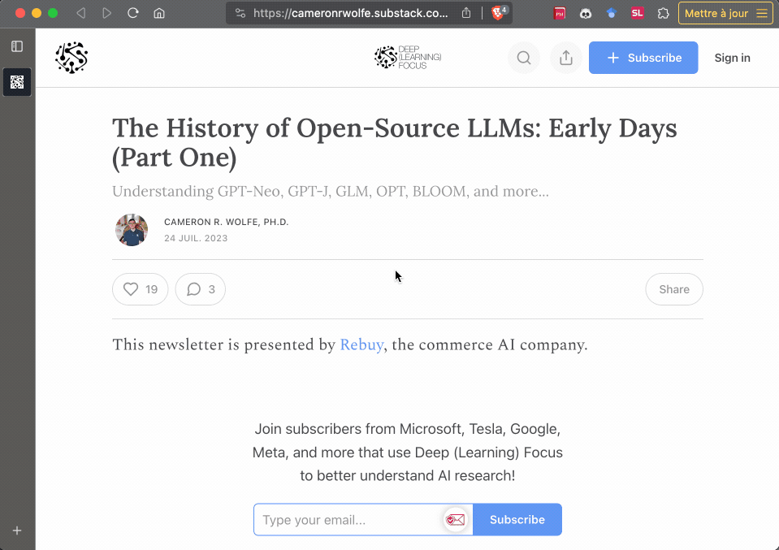
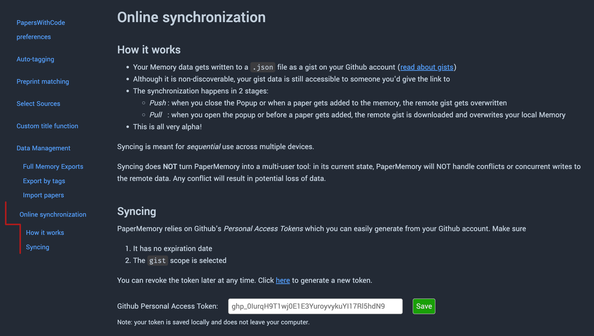

# Features

## User Guides

<p align="center">

</p>

<p align="center">

</p>

## Keyboard Navigation

Navigate the Popup with your keyboard:

-   Open the Memory:
    -   ++"A"++ from the popup's home will open it
    -   navigate to the bottom left button with ++tab++ and hit ++enter++
-   Search
    -   Search field is automatically focused on memory open
    -   Navigate to the top input with ++tab++ or ++shift+tab++
    -   More info on the search syntax down in the [Searching section](#searching)
-   Navigate papers
    -   ++tab++ will iterate through papers down the list
    -   ++shift+tab++ will go back up the list
-   Edit a paper
    -   Press ++e++ to _edit_ the paper's metadata: tags, code and note when the paper is _focused_ (from click or keyboard ++tab++ navigation)
    -   Navigate through fields with (++shift++ +) ++tab++: tags and note if you're on a paper's page.
    -   Press ++enter++ on the `Done` button to close the edits (they were already saved automatically)
-   Delete a paper
    -   Delete a focused paper with backspace
    -   A confirmation will be prompted first don't worry
-   Copy shortcuts
    -   ++o++ ↦ open the paper in a new tab.
    -   ++c++ ↦ copy the paper's link.
    -   ++m++ ↦ copy the paper's markdown link.
    -   ++b++ ↦ copy the paper's bibtex.
    -   ++h++ ↦ copy the paper's hyperlink.
    -   ++d++ ↦ show the paper's metadata.
-   Close Memory, Menu, Modals (such as the user guide) or Popup
    -   ++esc++ closes items up until you're back to the popup, at which point it will close the popup.
    -   :material-alert-box-outline: This does not work in Firefox. The whole popup will close at any point with ++esc++.

## Arxiv Enhancements

PaperMemory enhances paper pages on ArXiv.org to make its parsing abilities readily available without even opening the popup:

-   Displays the publication venue if one exists
-   Allows you to directly download a paper to your [PaperMemoryStore](#local-file-storage)


<p style="clear: both;" />

## Memory: Parsing papers

### Venues

In order to parse papers from the websites you visit, PaperMemory contains a custom function for each individual paper provider (ArXiv, ScienceDirect, OpenReview, Nature, Science, FrontiersIn, etc.).

<div class="annotate" markdown>
Whenever possible, PaperMemory queries the API the provider offers. If they don't offer an open and free API, PaperMemory will parse the page's `HTML` code. When on a PDF's page, PaperMemory contains an URL reversal process to go from PDF to Abstract page. If that cannot be infered from the URL because of the paper provider's URL scheme, there's nothing PaperMemory can do and the PDF will not be stored.(1)
</div>

1.  PDFs are notoriously hard to parse as stand-alone files, so PaperMemory cannot (currently) extract metadata from the raw file. This feature has a low priority and would require a PR to move forward.

??? info "PaperMemory known venues"

    * Arxiv
      * PaperMemory will try to find if a pre-print has been published and create a corresponding `note` to the paper (see [preprints](#preprint-matching))
      * Also detects and matches papers from [huggingface.co/papers](https://huggingface.co/papers), [arxiv-vanity.com](https://arxiv-vanity.com), [ar5iv.org](https://ar5iv.org) and [scirate.com/](https://scirate.com/)
    * BioRxiv
    * NeurIPS
    * Open Review (ICLR etc.)
    * Computer Vision Foundation (I/ECCV, CVPR etc.)
    * Proceedings of Machine Learning Research (PMLR) (AISTATS, ICML, CoRL, CoLT, ALT, UAI etc.)
    * Association for Computational Linguistics (ACL) (EMNLP, ACL, CoNLL, NAACL etc.)
    * Proceedings of the National Academy of Sciences (PNAS)
    * SciRate
    * Nature (Nature, Nature Communications, Nature Machine Intelligence etc.)
    * American Chemical Society (ACS)
    * IOPscience
    * PubMed Central
    * International Joint Conferences on Artificial Intelligence (IJCAI)
    * Association for Computing Machinery (ACM)
    * IEEE
    * Springer (books, chapters and, of course, articles)
    * American Physical Society (APS)
    * Wiley (Advanced Materials, InfoMat etc.)
    * Science Direct
    * Science (Science, Science Immunology, Science Robotics etc.)
    * FrontiersIn (Frontiers in Neuroscience, Frontiers in Neuroscience, Frontiers in Microbiology etc.)
    * PLOS
    * Royal Society of Chemistry
    * MDPI
    * Oxford University Press
    * HAL Archives ouvertes
    * [Sci-Hub](./faq.md#can-i-reference-my-pdf-in-papermemory)
    * [Add more](https://github.com/vict0rsch/PaperMemory/issues/13)

    [About finding published papers from preprints](#preprint-matching)

### Code repositories

PaperMemory uses [Papers With Code](https://paperswithcode.com)'s [API](https://paperswithcode.com/api/v1/docs/) to discover code repositories for your paper.

By default, PaperMemory only stores _official_ code repositories. You can configure that (and a preferred framework) in the [Advanced Options](./configuration.md#advanced-options).

??? example "How it works"

    PaperMemory uses the PapersWithCode API in order to discover code repositories. If the paper being added to the Memory is from Arxiv, PaperMemory will use PWC's `arxiv_id` search field. Otherwise it will query per title. PaperMemory then expects exactly `1` result from the API. Any different `count` in the response will make PaperMemory consider there is no match.

    If a match is found, the selected repo is the official (if it exists) one with the most stars (customizable in the Advanced Options).

    Here's an example return value from PWC's API

    ```json
    "https://paperswithcode.com/api/v1/papers/?title=climategan"

    {
    "count": 1,
    "next": null,
    "previous": null,
    "results": [
        {
        "id": "climategan-raising-climate-change-awareness",
        "arxiv_id": "2110.02871",
        "nips_id": null,
        "url_abs": "https://arxiv.org/abs/2110.02871v1",
        "url_pdf": "https://arxiv.org/pdf/2110.02871v1.pdf",
        "title": "ClimateGAN: Raising Climate Change Awareness by Generating Images of Floods",
        "abstract": "...",
        "authors": ["..."],
        "published": "2021-10-06",
        "conference": "climategan-raising-climate-change-awareness-1",
        "conference_url_abs": "https://openreview.net/forum?id=EZNOb_uNpJk",
        "conference_url_pdf": "https://openreview.net/pdf?id=EZNOb_uNpJk",
        "proceeding": "iclr-2022-4"
        }
    ]
    }

    "https://paperswithcode.com/api/v1/papers/climategan-raising-climate-change-awareness/repositories/"

    {
    "count": 2,
    "next": null,
    "previous": null,
    "results": [
        {
        "url": "https://github.com/cc-ai/climategan",
        "owner": "cc-ai",
        "name": "climategan",
        "description": "Code and pre-trained model for the algorithm generating visualisations of 3 climate change related events: floods, wildfires and smog. ",
        "stars": 25,
        "framework": "pytorch",
        "is_official": true
        },
        {
        "url": "https://github.com/cc-ai/mila-simulated-floods",
        "owner": "cc-ai",
        "name": "mila-simulated-floods",
        "description": "",
        "stars": 7,
        "framework": "pytorch",
        "is_official": true
        }
    ]
    }

    ```

### Searching

You can search for (partial) terms:

-   In a paper's authors, title and note.
    -   Split queries on spaces: `gan im` will look for: _all papers whose (title OR author) contain ("gan" AND "im")_
-   In a paper's code link
    -   Start the search query with `c:` to only search code links
-   Paper years
    -   Start the search query with `y: ${year}`, optionally with `,` separating requested years or starting with `>` or `<` to filter paper published after/before a given year (stricly)
        -   `y: 20,21,22` will display papers published in `2020 OR 2021 OR 2022`
        -   `y: <2015` will display papers published before (strictly) `2015`
        -   `y: >19` will display papers published after (strictly) `2019`
-   Paper tags
    -   Start the search query with `t:` to filter by tags
    -   `t: gan` will look for _all papers whose tag-list contains at least 1 tag containing "gan"_
    -   `t: gan tim` will look for _all papers whose tag-list contains (at least 1 tag containing "gan") AND (at least 1 tag containing "tim")_

### Preprint matching

There currently exists, to my knowledge, no centralized source for matching a preprint to its subsequent published article. This makes it really hard to try and implement best practices in terms of citing published papers rather than their preprint.

My approach with PaperMemory is to try and notify you that a publication likely exists by utilizing the `note` field. You will occasionally notice `Accepted @ X` in a Paper's notes. This will be added automatically if you are on a known published venue's website (as Nature, PMLR or NeurIPS) but also from PapersWithCode, DBLP.org SemanticScholar.org, CrossRef.org and Unpaywall.org.

??? example "How it works"

    Here's an overview of jhow PaprMemory deals with publication APIs:


    * [PapersWithCode.com](https://paperswithcode.com)

        * A query is sent to their [api](https://paperswithcode.com/api/v1/docs/) from an Arxiv ID or a paper's plain text title if it's not an Arxiv paper
        * As PaperMemory retrieves code, it also looks for a `proceeding` field in PWC's response.
        * If it exists and is not `null` then it is expected to look like `${conf}-${year}-${month}`.
        * In this case a note is added to the paper: `Accepted @ ${conf} ${year} -- [paperswithcode.com]`

    * [dblp.org](https://dblp.org)

        * A query is sent to their [api](https://dblp.org/faq/How+to+use+the+dblp+search+API.html) for an exact paper title match
        * The oldest `hit` in the response which is not a preprint (`hit.venue !== "CoRR"`) is used
        * If such a match is found, a note is added as: `Accepted @ ${venue} ${year} -- [dblp.org]`

            * In this case, **the original Arxiv bibtex data is overwritten to use DBLP's**
            * Try for instance [Domain-Adversarial Training of Neural Networks](http://arxiv.org/pdf/1505.07818v4)
            * Note that DBLP journals may use ISO4 abbreviations

    * [SemanticScholar.org](https://www.semanticscholar.org/)

        * A query is sent to their [api](https://www.semanticscholar.org/product/api) for an exact paper title match
        * Up to 50 relevant papers are returned in `response.data` as an `Array`
        * In case of a match, the venue should not be `"ArXiv"`
        * If there's a match and its venue is not Arxiv then `match.venue` and `match.year` are used to create a note: `Accepted @ {venue} ({year}) -- [semanticscholar.org]`

    * [CrossRef.org](https://crossref.org)

        * A query is sent to their [api](https://api.crossref.org/swagger-ui/index.html) for an exact paper title match
        * The response *must* contain an `event` field with a `name` attribute. If it does not it'll be ignored.
        * If it does, a note is added as: `Accepted @ ${items.event.name} -- [crossref.org]`

            * Try for instance [Attention-Guided Generative Adversarial Networks for Unsupervised Image-to-Image Translation](http://arxiv.org/pdf/1903.12296v3)

    * [Unpaywall.org](https://unpaywall.org)

        * A query is sent to their [api](https://unpaywall.org/products/api) searching for papers
        * Amongst `response.results`, we're looking for an exact title match.
        * If there's one, a to the paper note is added as: `Accepted @ ${result.journal_name} -- [unpaywall.org]`

    There's room for improvement here^, please contact me (an issue will do) if you want to help

### Parsing arbitrary websites

{ align=right .demo-gif }

PaperMemory allows you to parse any website, such as blog posts, PDFs hosted on personal websites, documentations etc.

Just hit the `Parse Current Website` button and adjust the automatically-filled fields.

A _website_ will be exported as a BibTex entry like:

```
@misc{wolfe2023history,
  author = {Cameron Wolfe},
  title  = {The History of Open-Source LLMs: Early Days (Part One)},
  year   = {2023},
  url    = {https://cameronrwolfe.substack.com/p/the-history-of-open-source-llms-early},
  note   = {Accessed 2023-11-20},
}
```

<p style="clear: both;"/>

## Bibliography tools

-   **Copy** the BibTex entry of the current paper from the Popup or any paper in your Memory by clicking the :tabler-math-function: icon
-   **Export** all papers with a given tag into a `.bib` file in the [Advanced Options](./configuration.md#advanced-options).
-   **Match** the ArXiv pre-prints of an existing `.bib` file to actual publications with PaperMemory's [BibMatcher](./getting-started.md#bibmatcher)

## Local File Storage

PaperMemory can store pdfs in your Downloads folder and use this file instead of re-downloading a pdf from the internet.

How it works:

-   Enable the feature from the :octicons-gear-16: Popup Menu
-   Click on the :tabler-file-download: Download button in the PaperMemory popup when reading a paper
-   The extension creates a `PaperMemoryStore/` folder in your `Downloads/`
-   PDFs are stored in there
-   When opening a paper from your Memory, if it is not already open in a tab, the extension will open a new tab (or your PDF reader, the Browser decides) to the local file instead of the paper's online pdf

**Limitations**:

<div class="annotate" markdown>

-   PaperMemory can _only access folders in your Downloads_ so the storage _has_ to happen there
-   It relies on **title matching** to 1/ Open a local file from the Memory 2/ Detect if a currently open file is a known paper to display the Popup. Make sure to have the title in your custom title function.
-   If you move files or rename them altering the titles they may not be detected anymore (1).

</div>

1.  PaperMemory primarily relies on <a href="https://developer.chrome.com/docs/extensions/reference/downloads/#type-DownloadItem"
            target="_blank" rel="noopenner noreferrer">`file.finalUrl`</a> to detect if a file corresponds to a known paper. If, for some reason this were to fail, the secondary matching strategy relies on said file name / paper title string matching.

## Online Synchronization

{ align=right .demo-gif }

Your data can be synced online to be safe-guarded or shared across devices using [Github Gists](https://docs.github.com/en/get-started/writing-on-github/editing-and-sharing-content-with-gists/creating-gists#about-gists).

This means your data gets written as a commit to a Gist on your Github account, and Papers added to your memory will be saved there. You can use this to sync your full memory across devices.

This feature can be enabled in the [Advanced Options](./configuration.md#advanced-options).

<p style="clear: both;" />

!!! warning

    Syncing is meant for **sequential** use across multiple devices.

    Syncing does NOT turn PaperMemory into a multi-user tool: in its current state, PaperMemory will NOT handle conflicts or concurrent writes to the remote data. Any conflict will result in potential loss of data.

## Privacy

None of your data ever leaves your computer, except when you enable Gist Synchronization.

In this case, you voluntarily upload your data to Github Gists. Remember, although private Gists are non-discoverable, they are accessible to anyone with the link. So don't store personal or sensitive information in your paper notes if you enable Gists Synchronization.

## Feature requests

I'm regularly adding feature ideas in the [issues](https://github.com/vict0rsch/PaperMemory/issues). Feel free to go upvote the ones you'd like to see happen or submit your own requests.
