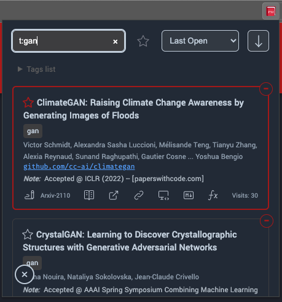
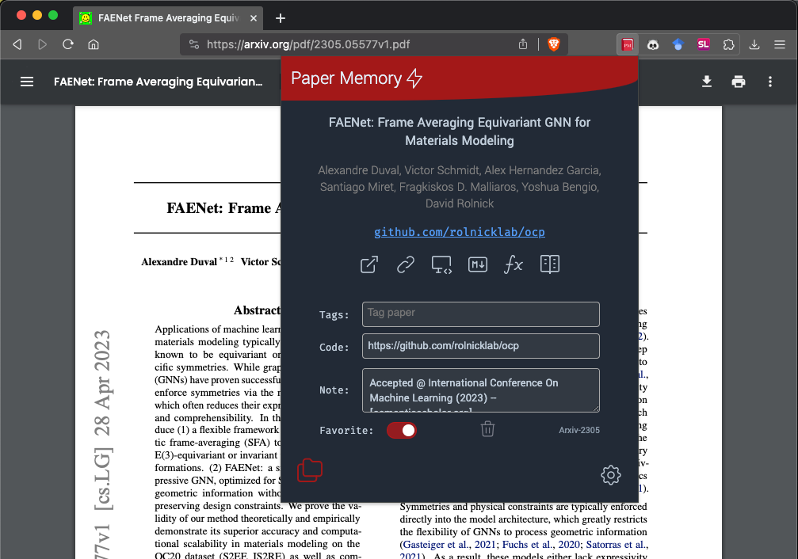

# Getting Started

## Installation

{ align=right .demo-gif }

### Browser Stores

[:fontawesome-brands-chrome: Chrome / :simple-brave: Brave / :fontawesome-brands-edge: Edge](https://chromewebstore.google.com/detail/paper-memory/hmebhknlgddhfbbdhgplnillngljgmdi?pli=1){ .md-button .md-button--primary }

  [:fontawesome-brands-firefox-browser: Firefox](https://addons.mozilla.org/en-US/firefox/addon/paper-memory/){ .md-button .md-button--primary }

### From source

=== "Chrome / Brave / Edge"

    * Clone the repo
    * Go to Chrome/Brave's extension manager `chrome://extensions/`
    * Enable developer mode (top right)
    * Click on the "Load unpackaged extension" button
    * Select the downloaded folder

=== "Firefox"

    * Clone the repo
    * Go to `about:debugging#/runtime/this-firefox` in the address bar
    * Click on "Load Temporary Add-on"
    * Select the `manifest.json` file in the `PaperMemory/` folder
    * __NB__ this is a temporary install you may have to re-do this loading operation if you close Firefox

!!! tip

    For better usability, I recommend that you *pin* the PaperMemory extension to your browser's toolbar.

## Main components

### Popup

{ align=right }

Your main interface to PaperMemory is its popup. You can open it by clicking on the PaperMemory extension icon or using the default keyboard shortcut ++ctrl+shift+"E"++ or ++cmd+shift+"E"++.

!!! tip "User Guide"

    The `User Guide` also contains a recap of keyboard shortcuts and search syntax.

!!! info "Keyboard Shortcuts"

    You can customize keyboard shortcuts (or verify that they work), see [Configuration](configuration.md#keyboard-shortcuts)

### Popup Menu

{ align=right }

By clicking on the popup bottom-right :octicons-gear-16: symbol, you can open the customization menu.

### Memory

{ align=right }

Open your Memory (*i.e.* the list of your papers) by clicking on the popup bottom-left :material-folder-multiple-outline:{ color="red" } button.

In the search bar, you can search by title or author, prefix by `t:` to search for tags or by `y:` to search by year. More information in [Searching for papers](features.md#searching).

You can also

* :tabler-star: Mark a paper as Favourite
* :tabler-writing: Edit the paper's tags, code link and note
* :tabler-vocabulary: open a downloaded PDF
* :tabler-external-link: Go to the paper's online page (1)
* :octicons-link-24: Copy the link to the paper (1)
* :tabler-device-desktop-code: Copy a formatted hyperlink (for emails for instance)
* :material-language-markdown-outline: Copy a `[$title]($url)` Markdown-formatted link (1)
* :tabler-math-function: Copy a BibTex entry for your `.bib` bibliography.

1.  PDF or Abstract depending on your settings

### Paper page

{ align=right .advanced-screenshot }

When on a known article's page, PaperMemory will display its meta-data (title, authors, code link), similar actions as in the memory (:tabler-writing:, :tabler-vocabulary:, :tabler-external-link:, :octicons-link-24:, :tabler-device-desktop-code:, :material-language-markdown-outline:, :tabler-math-function:) and customization options.

### BibMatcher

{ align=right .advanced-screenshot }

At the bottom of the Popup Menu, click on the *PaperMemory BibMatcher* link to open a tool that allows you to seamlessly match Arxiv references in your `.bib` file to actual publications, using the PaperMemory's [preprint matching feature](features.md#preprint-matching).

### Advanced Options

{ align=right .advanced-screenshot }

More customization options and features are available in the advanced options page:

* Right click on the extension's button in your browser toolbar and select *Options*
* Open the Popup Menu, scroll down and click on *Options page*.

More details in [Configuration](configuration.md#advanced-options).

