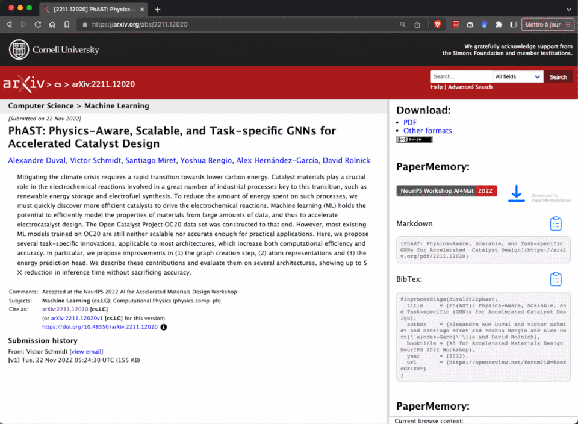

This documentation / showcase is **WORK IN PROGESS**

    <h1 style="color: white; max-width: 400px; padding-right: 1rem;">
        <strong style="color: red">PaperMemory</strong> automatically records and organizes papers your read, without ever leaving your browser.
    </h1>
    

 
PaperMemory is designed to be a fast, lightweight and user-friendly in-browser reference manager, with tons of features to make your life easier.
 
 

-   :fontawesome-solid-wand-magic-sparkles:{ .lg .middle } __Parse papers you open automatically__

    Papers are stored in your Memory, you can them search them, tag them, take personal notes etc. This is all one click away from your browser's extension store (:fontawesome-brands-chrome: Chrome / :simple-brave: Brave / :fontawesome-brands-firefox-browser: Firefox / :fontawesome-brands-edge: Edge).

    [:octicons-arrow-right-24: Getting started](getting-started)

    ---

-   :fontawesome-solid-fire:{ .lg .middle } __Match preprints to publications__

    By querying SemanticScholar, DBLP and CrossRef, PaperMemory can discover the proper publication of Arxiv pre-prints.

    [:octicons-arrow-right-24: Getting started](getting-started)

    ---

-   :fontawesome-solid-file-code:{ .lg .middle } __Discover code repositories__

    Using the PapersWithCode API, PaperMemory will store code repositories with papers in your Memory.

    [:octicons-arrow-right-24: Getting started](getting-started)

    ---

-   :simple-arxiv:{ .lg .middle } __Enhance ArXiv.org__

    Download the paper directly to your PaperMemoryStore, see the publication venue, copy a markdown link `[title](url)` or a BibTex entry.

    [:octicons-arrow-right-24: Arxiv Enhancements](features#arxiv-enhancements)

    ---

-   :material-square-root-box:{ .lg .middle } __Instantly copy `.bib`-compatible bibliography entries__

    Export papers as BibTex entries from the extension, or group exports by tag. You can even use PaperMemory to update the ArXiv entries of a stand-alone `.bib` file.

    [:octicons-arrow-right-24: Bibliography tools](features#bibliography-tools)

    ---

-   :octicons-gear-24:{ .lg .middle } __Highly customizable__

    Change the theme to light or dark, control the default link copied to your clipboard, add links to SciRate / HuggingFace Papers / Ar5iv / ArxivSanity, trigger parsing manually, export / import papers etc.

    [:octicons-arrow-right-24: Configuration](configuration)

    ---

-   :octicons-rocket-16:{ .lg .middle } __And many more features!__

    Github Gist synchronization, regex-based automatic paper tagging, arbitrary website parsing to record Blog posts or dataset websites, etc.

    [:octicons-arrow-right-24: All features](features)

    ---

<!--

    

        

        feature description feature description feature description feature description feature description feature description
        

        

        feature description feature description feature description
        

    

    

    
    

        

        feature description feature description feature description feature description feature description feature description
        

        

        feature description feature description feature description
        

    

 -->

