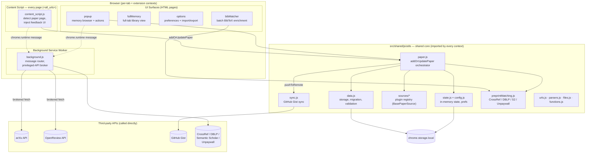

# PaperMemory — System Architecture

> Source of truth for the repository's architecture. Read this before broad
> grepping. Keep it current when components, boundaries, data flow, key
> abstractions, or integrations change (see `.claude/rules/keep-system-architecture-up-to-date.md`).
>
> **This doc covers how the system works** — mental model, data flow,
> abstractions, design rationale, invariants. For how to set up, build, and
> contribute (commands, conventions, step-by-step how-tos, tests, release), see
> [`contributing.md`](contributing.md).
>
> **This doc covers how the system works** — mental model, data flow,
> abstractions, design rationale, invariants. For how to set up, build, and
> contribute (commands, conventions, step-by-step how-tos, tests, release), see
> [`contributing.md`](contributing.md).

## Overview

**PaperMemory** is a cross-browser (Chrome/Brave/Edge + Firefox) WebExtension that
acts as an automated, minimalist reference manager for research papers. As the user
browses, it silently detects when a tab is a known paper page (arXiv, OpenReview,
NeurIPS, Nature, IEEE, and ~30 other academic sources), parses the paper's metadata,
and records it in a local library ("the Memory"). On top of recording, it enriches
papers: it discovers code repositories, matches preprints to their published
versions across several bibliographic databases, generates BibTeX and Markdown
links, rewrites PDF tab titles to human-readable names, and can sync the whole
library to a private GitHub Gist.

The system is a **client-side-only** application: there is no backend owned by the
project. All persistence is in `chrome.storage.local`; all enrichment happens by
calling third-party public APIs directly from the extension. The "server" role is
played entirely by the **background service worker**, which brokers
cross-origin fetches and privileged browser APIs on behalf of UI surfaces and
content scripts.

The target reader of this document is an engineer who needs to reason about how a
URL becomes a stored, enriched paper — and how to add a new paper source or UI
surface without breaking the (deliberately load-order-sensitive) module graph.

## System Architecture

PaperMemory is built with **[WXT](https://wxt.dev/)** (`wxt.config.js`), which
compiles the `src/` tree into a Manifest V3 extension. WXT's role is purely
build-time: it wires `src/entrypoints/*` into manifest-declared contexts (background
worker, content script, and four HTML pages), applies the `@pm` / `@pmu` path
aliases, and produces per-browser bundles. There is no runtime framework — the code
is plain ES modules plus jQuery and Tom Select for DOM work.

### Communication patterns

- **Shared-core imports.** The bulk of logic lives in `src/shared/js/utils/` and is
  imported directly into whichever context needs it (popup, content script, worker).
  There is one logical codebase executed in several JS realms; `state`/`config.js`
  is a per-realm singleton, **not** shared memory across contexts.
- **Message passing (`chrome.runtime`).** Used for two things: (1) the content
  script and popup ask the background worker to perform privileged or
  cross-origin operations they cannot do themselves; (2) the worker pushes
  commands (keyboard shortcuts, tab-URL changes) into content scripts. The router is
  the single `chrome.runtime.onMessage` listener in `background.js` (a `type`-keyed
  `if/else` chain). It rejects messages whose `sender.id !== chrome.runtime.id`.
- **Storage as the integration bus.** All contexts read/write the same
  `chrome.storage.local` `papers` object. `addOrUpdatePaper` re-reads `papers`
  immediately before every write and merges, because multiple tabs may parse the
  same paper concurrently (see *Concurrency* below).

### Why the background worker brokers fetches

Several source parsers (`arxiv.js` via `fetch-arxiv-xml`, `openreview` via
`OpenReview*JSON`) and all preprint-matching calls are routed through the worker
even though `fetch` exists in content scripts. The worker holds `host_permissions:
["*://*/*"]`, so it can issue cross-origin requests without being subject to the
visited page's CSP or CORS posture. Content scripts delegate via
`sendMessageToBackground({ type: ... })`.

## Core Concepts & Abstractions

### Paper sources — the plugin registry

The defining abstraction is the **paper source**: a class extending
`BasePaperSource` ([`sources/base.js`](src/shared/js/utils/sources/base.js)) that
knows how to recognise and parse one family of URLs. Sources are **stateless** —
the class is never instantiated; only static members are used, and papers stay
plain objects. Each source declares:

- `name` — internal key, matches `paper.source` and the `is.{name}` flag.
- `displayName`, `isPreprint`, and `patterns` (string substrings or
  `(url) => boolean` predicates).
- `matches(url)`, `urlToId(url, ctx)`, `parse(url, tab, ctx)`, plus URL
  transforms `toAbs` / `toPDF` and venue helpers.

All ~32 concrete sources are registered **once** in
[`sources/index.js`](src/shared/js/utils/sources/index.js)'s `ALL_SOURCES` array.
From that single list the module derives every lookup the rest of the code needs:
`getSource(name)`, `knownPaperPages` (consumed by `isPaper`), `sourceFromIs`,
`matchUrl`, `preprintSources`, and `SOURCE_DISPATCH_ORDER`. **Adding a source = create
the module + add one import/array entry.** Patterns must be mutually exclusive — this
is enforced by the "Source Pattern Mutual Exclusion" test in `test/test-meta.js`.
For the step-by-step procedure, see
[`contributing.md` → Adding a paper source](contributing.md#adding-a-paper-source).

`WebsiteSource` is special: it is the universal fallback for arbitrary pages and is
**excluded** from `DISPATCH_SOURCES`. It is invoked explicitly in `paper.js`
(`getSource("website")`) when the user manually parses a non-academic page, never via
pattern dispatch.

> **Load-order constraint (documented in `base.js`):** `functions.js` imports
> `getSource` from `sources/index.js`, which imports every concrete source — some of
> which import back from `functions.js`. This cycle is safe **only** because source
> modules consume `functions.js` bindings inside method bodies (runtime), never at
> module top level. Evaluating a `functions.js` export inside a static initialiser
> (e.g. `static patterns = [...]`) hits a Temporal Dead Zone and crashes the
> extension at load.

### The "is" map and source dispatch

[`isPaper(url)`](src/shared/js/utils/paper.js) returns an object `is` mapping every
source name → boolean (plus `localFile`, `stored`, `parsedWebsite`). This map is the
currency of dispatch: `sourceFromIs(is)` walks `DISPATCH_SOURCES` and returns the
first source whose flag is set, while `parseIdFromUrl` walks `SOURCE_DISPATCH_ORDER`
to resolve a stable id. Because patterns are mutually exclusive, dispatch order is
not semantically meaningful.

### Stable IDs and de-duplication

A paper's identity is its `id` (e.g. `Arxiv-2103.12345`, `Website_<hash>`). Two
fuzzy de-dup mechanisms keep the library clean:

- **`urlHashToId`** — `miniHash(url) → id`, a fast cache so a revisited URL
  resolves without re-parsing.
- **`titleHashToIds`** — `miniHash(title) → [ids]`, used by `findFuzzyPaperMatch` to
  detect that a freshly parsed paper is the same work as an existing one under a
  different source (e.g. an arXiv preprint and its NeurIPS published version).
  `preprintSources` is consulted so a non-preprint match is preferred as the
  canonical record.

## Data Models

### The `paper` object

The single domain entity. It is a plain object validated (and defaulted) by
[`validatePaper`](src/shared/js/utils/data.js) against a schema of expected keys:

| Field | Type | Notes |
|---|---|---|
| `id` | string | Unique PaperMemory id; primary key in `papers` |
| `source` | string | A registered source `name` |
| `title`, `author`, `year`, `venue` | string | Core metadata (`author` is ` and `-separated) |
| `bibtex`, `key`, `doi` | string | Citation data; `key` is the BibTeX key |
| `pdfLink`, `md` | string | PDF URL and a pre-rendered Markdown link |
| `codeLink`, `code` | string/object | Repo URL + raw PapersWithCode payload |
| `note` | string | Free-text + auto-generated "Accepted @ …" venue notes |
| `tags` | string[] | User + auto-tags (`autoTagPaper`) |
| `favorite`, `favoriteDate` | bool/string | Starring |
| `count`, `addDate`, `lastOpenDate` | number/string | Visit tracking + sort keys |
| `extras` | object | Optional per-source overflow |

### Storage layout (`chrome.storage.local`)

The `papers` key holds an `{ id → paper }` map plus a `__dataVersion` sentinel.
Other top-level keys: `prefs`/menu checks, `autoTags`, `ignoreSources`,
`urlHashToId`, sync state, and periodic backups. `unlimitedStorage` is requested so
the library can grow without quota errors.

### Migration

[`migrateData`](src/shared/js/utils/data.js) runs on every `initState`. It compares
the stored `__dataVersion` against a hardcoded `latestDataVersion` and applies an
ordered chain of `if (currentVersion < N)` blocks that mutate papers in place
(backfilling defaults, renaming sources, fixing links), recording a per-paper
`migrationSummaries` audit trail. A backup is taken before migrating.

### In-memory state

`config.js` exports a per-realm `state` singleton (current papers, sorted lists,
tags, prefs, the title-rendering function, hash caches, UI flags). `state.js`
`initState` is the canonical hydrator: load papers → backup → migrate → load prefs &
caches → (UI contexts only) match local files, sort, build tag set. It is invoked in
the worker, popup, content script, and full-memory page.

## Component Deep-Dive

### `paper.js` — the parse/enrich/store orchestrator
**Location:** [`src/shared/js/utils/paper.js`](src/shared/js/utils/paper.js)
The heart of the system. `addOrUpdatePaper({url, is, prefs, tab, ...})` is the single
funnel through which papers enter the Memory. Its pipeline: resolve id
(`parseIdFromUrl`) → update-visit-or-`makePaper` → fuzzy-dedup merge
(`mergePapers`) → PapersWithCode code discovery (`tryPWCMatch`) → write to storage →
`pushToRemote` → asynchronous preprint matching (`tryPreprintMatch`) to backfill
venue/bibtex → second write. Caller-supplied `contentScriptCallbacks`
(`update`/`preprints`/`done`/`feedback`) let the content script render progressive
feedback. `makePaper` dispatches to `src.parse()` and stamps `paper.source`.

### `sources/*` — source plugins
**Location:** [`src/shared/js/utils/sources/`](src/shared/js/utils/sources/)
~32 `BasePaperSource` subclasses + the `index.js` registry + `WebsiteSource`
fallback. See *Core Concepts*. Source-specific scraping helpers were factored out of
`functions.js` into per-source modules (recent refactor, commits `1b18d72`/`ebf02e1`).

### `background.js` — service worker
**Location:** [`src/background/background.js`](src/background/background.js)
(entrypoint wrapper at `src/entrypoints/background.js`). Hosts the message router,
brokered fetches (arXiv XML, OpenReview notes/forums, Google Scholar, the
preprint-matching APIs), the toolbar badge state machine
(`badgeOk/Wait/Error/Clear`), keyboard-command handlers (`manualParsing`,
`downloadPdf`, `defaultAction`), the PDF-title rewriter (`chrome.tabs.onUpdated` +
`chrome.scripting.executeScript`), and Gist push/pull. On popup disconnect it pushes
sync.

### `content_script.js` — page integration
**Location:** [`src/content_scripts/content_script.js`](src/content_scripts/content_script.js)
Injected at `document_start` on `<all_urls>`. On load it runs `initSyncAndState`,
pings the worker (`hello`), then calls `isPaper(url)`; on a hit it invokes
`addOrUpdatePaper` and renders the floating feedback notification. Also listens for
worker-pushed commands and provides in-page actions (copy BibTeX/MD link, open
abstract/PDF/ar5iv/HuggingFace, etc., shared with the popup's `handlers.js`).

### UI surfaces — `popup`, `fullMemory`, `options`, `bibMatcher`
**Location:** `src/popup/`, `src/fullMemory/`, `src/options/`, `src/bibMatcher/`
(thin `src/entrypoints/*/main.js` wrappers import the real logic + `debug.js`).
- **popup** ([`popup/js/popup.js`](src/popup/js/popup.js), `memory.js`, `handlers.js`,
  `templates.js`) — primary surface: searchable/sortable memory list, per-paper
  actions, the preferences menu, and on-open parsing of the active tab. HTML is
  assembled from `popup/html/**` fragments via a custom `<!--=include -->` Vite
  plugin (`htmlIncludePlugin` in `wxt.config.js`).
- **fullMemory** — the popup's memory view in a full browser tab.
- **options** — preferences, custom PDF-title function, auto-tag rules, JSON/BibTeX
  import & export, sync configuration.
- **bibMatcher** — a standalone tool: paste a `.bib` file, batch-match each entry
  against DBLP/Semantic Scholar/CrossRef/Unpaywall/Google Scholar to fill in
  published venues. Built directly on `preprintMatching.js`.

### `sync.js` — GitHub Gist synchronisation
**Location:** [`src/shared/js/utils/sync.js`](src/shared/js/utils/sync.js)
Optional cross-device sync via a private GitHub Gist using a user-supplied Personal
Access Token (`@octokit/request`). `getIdentifier` stamps writes with a per-device
`__syncId` so a device ignores its own echoes on pull. `pushToRemote` is fired
after every storage write; pull/merge happens on init and popup connect.

### Supporting utilities
`data.js` (storage/migration/validation/prefs), `urls.js` (id resolution),
`parsers.js` (DOM/JSON/BibTeX fetch helpers + DC meta-tag extraction),
`bibtexParser.js`, `files.js` (matching downloaded PDFs in `PaperMemoryStore/` via
the `downloads` API), `functions.js` (49 misc helpers incl. `miniHash`,
`sendMessageToBackground`), `miniquery.js` (a tiny jQuery-ish DOM helper).

## Key Workflow — automatic capture of a paper

1. User opens e.g. `https://arxiv.org/abs/2103.12345`.
2. WXT-injected **content script** runs `initSyncAndState`, pings the worker,
   computes `is = isPaper(url)`.
3. `is.arxiv` is true → `addOrUpdatePaper({url, is, prefs})`.
4. `parseIdFromUrl` → `ArxivSource.urlToId` → `Arxiv-2103.12345` (de-dup against
   `titleHashToIds` for an existing published version).
5. New id → `makePaper` → `ArxivSource.parse`, which asks the **worker** to fetch
   `export.arxiv.org/api/query` (`fetch-arxiv-xml`), parses the Atom XML into a
   `paper`, builds a BibTeX entry.
6. `initPaper` defaults fields, runs `autoTagPaper`, `validatePaper`.
7. PapersWithCode code discovery → write `papers` to storage → `pushToRemote`.
8. Async `tryPreprintMatch` queries CrossRef/DBLP/S2/Unpaywall to backfill the
   published venue/bibtex; a second storage write persists it.
9. Content-script callbacks render "Saved ✓ (+ repo …)" feedback; the worker may
   rewrite the PDF tab title.

## Concurrency & Invariants

- **Concurrent writers.** Multiple tabs can parse the same paper simultaneously.
  `addOrUpdatePaper` re-reads `papers` from storage immediately before each
  `chrome.storage.local.set` and merges (`mergePapers`, `incrementCount`) rather
  than blindly overwriting. Treat `state.papers` as a stale snapshot, never the
  source of truth at write time.
- **Pattern mutual exclusion** across sources is a hard invariant (test-enforced).
- **No top-level use of `functions.js` exports inside source modules** (TDZ — see
  the `base.js` constraint above).
- **`state` is per-realm.** Do not assume the popup's `state` reflects the content
  script's; reconcile through storage.

## Technical Stack

- **Build:** WXT 0.20 (Vite under the hood), Manifest V3, dual Chrome/Firefox output.
- **Runtime libs:** jQuery 4, Tom Select 2 (tag inputs), `@octokit/request` (Gist).
- **Language:** plain ES modules (`"type": "module"`), JSDoc-typed, no TypeScript;
  `jsconfig.json` + `@pm`/`@pmu` path aliases.
- **Tooling:** Prettier; Mocha + jsdom + [cloakbrowser](https://github.com/CloakHQ/cloakbrowser)
  (source-level stealth Chromium, Puppeteer-core API) for the `test/test-*.js`
  suite (unit + headless-browser integration). `npm test` builds Chrome first
  (`pretest`) then runs Mocha. The cloakbrowser binary (~200MB) auto-downloads
  to `~/.cloakbrowser` on first use; CI caches it via `actions/cache`.
- **External APIs (no project backend):** arXiv, OpenReview, GitHub Gist, CrossRef,
  DBLP, Semantic Scholar, Unpaywall, Google Scholar, (historically PapersWithCode —
  its API is currently stubbed out in `background.js`).
- **Permissions:** `activeTab`, `storage`, `unlimitedStorage`, `downloads`(+`.open`),
  `scripting`, and `host_permissions: *://*/*`.
- **Docs site:** MkDocs Material (`mkdocs.yml`, `docs/`) published to papermemory.org.

## Key Design Decisions

- **Stateless source classes over instances (Option A, per `base.js`).** Saved
  papers are plain objects (JSON in `chrome.storage`, runtime messages, and Gist
  sync), and MV3 service workers terminate frequently — so there is no long-lived
  "paper with methods" to hydrate, and prototype identity would be lost across
  every storage/message boundary anyway. Each source is therefore a stateless
  `BasePaperSource` subclass: dispatch is a name lookup in the registry followed by
  a static method call (`ArxivSource.parse`, …). That is one hash lookup per
  dispatch — the same cost order as the large `switch` statements it replaced —
  without the serialisation hazards of class instances.
- **Single registry array as the only edit point** for sources, with all lookups
  derived from it — minimises the surface area and footguns of adding a source.
- **Background worker as a fetch/permission broker** rather than a stateful server —
  keeps the architecture backend-free while sidestepping page CSP/CORS.
- **Storage-as-bus with read-before-write merges** instead of a lock — pragmatic
  concurrency control for an extension with no shared memory across realms.
- **Gist-based sync with device `__syncId` tagging** — zero project infrastructure,
  user owns their data and credentials.
- **Two-phase enrichment** (fast parse + store, then async venue/code backfill) so
  the user gets immediate feedback while slow third-party lookups complete in the
  background.
